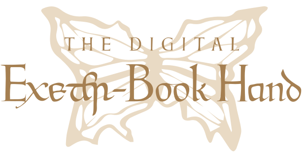

<h1 align="center">
  
</h1> 

This is the repository for **The Digital Exeter-Book Hand** ([exeterbookhand.com](https://www.exeterbookhand.com)), an independent project that has been created to encourage the study and appreciation of the scribal hand of the Exeter MS 3501, commonly known as the Exeter Book.

The Exeter Book is one of the four major surviving miscellanies of Old English literature. It acquired its name because it has been in the care of the Exeter Cathedral since it was donated to the library there by Bishop Leofric, sometime before 1072. Written around AD 970, the Exeter Book was described in Leofric’s donation list as a _mycel Englisc boc be gehwilcum þingum on leoð-wisan geworht_ (‘a large English book about all sorts of things composed in verse’), with texts ranging from religious narrative to didactic poems and riddles. The script is English Square minuscule, which emerged from the earlier pointed minuscule developed in the British Isles. Elegantly crafted by the Exeter Book scribe, this Square minuscule hand was deemed by Sir E. M. Thompson to be a standard example of what 10th-century scribes aspired to emulate.

The project includes the following resources:
  * [**EBH Font Collection**](#ebh-font-collection) – a set of OpenType fonts covering most letters and ligatures within the manuscript
  * **EBH Digital Edition** – an online book-hand edition of selected poems from the Exeter Book for students and general audiences
 
# EBH Font Collection

EBH (short for Exeter-Book Hand) is a digital type of revival based on the hand of the scribe and illuminator who produced the Exeter MS 3501. The overall shape of the script is very upright, with long ascenders and descenders and a fine balance of light and heavy strokes, whereas the ornamentation takes the form of initials made up of elements common in both Germanic and Celtic art. 

This font collection covers the great majority of letter forms, punctuation and diacritical marks found in the manuscript, with an extension of the modern character set. It comes in four types:

  * **Facsimile** is complete with Old English characters, ligatures, and archaic or special forms of letters (e.g. long **S**, bowed **R**, and three different shapes of **Y**). It also contains the medieval punctuation and abbreviations employed by the scribe.

  * **Alternates** offers some contemporary characters interpreted in the scribal hand style (e.g. lowercase **R** and **S**), as well as letters that were not used by English scribes in the 10th century (e.g. **J** and **W**). This character set omits most of the ligatures but adds numerals, punctuation and symbols commonly used today.

  * **Runes** covers the Old English runes that are present in the manuscript, plus the ones used in the 10th century. (In the Exeter MS 3501, runes are most often found in riddles and sporadically in the Message of the Husband and two poems with Cynewulf’s runic signatures.)

  * **Initials** features the enlarged and often decorated letters that were used to mark the beginning of each poem. As with the other styles in this set, this font contains not only the initials that appear in the manuscript, but also the creation of new ones.

As of December 2021, EBH has a total of 330 glyphs, all of which are described in [EBH-all-glyphs.pdf](EBH-all-glyphs.pdf). Specimens are on the [project website](https://www.exeterbookhand.com).

## Notes to Users

### 1. Enabling ligatures in WS Word

Ligatures are joined letterforms commonly found in medieval manuscripts. To apply this effect, you need to ensure that the OpenType feature, Standard Ligatures (liga), is enabled on your application.

This feature is on by default in most graphic design and office applications. In Microsoft Word, however, you must manually enable automatic ligature substitution on the **Advanced** tab of the **Font** dialog box:

Here is an example of the Old English word **wæter** using EBH **Facsimile**:

| Ligatures ON            | Ligatures OFF |
:-------------------------:|:-------------------------:
  |  

### 2. Using alternative glyphs

All EBH fonts contain alternative glyphs for a number of characters. Accessing these glyphs is easy. For example, in EBH **Facsimile**, there are three forms of the lowercase letter **Y**, and each of them is assigned a combination of keys, such as **`y`** , **`y`**+**`2`**, and **`y`**+**`3`**:

| Key             |  Character | Description |
:-------------------------:|:-------------------------:|:-------------------------:
**`y`**          |    | curved Y (typical of square minuscule) 
**`y`**+**`2`**  |    | straight-sided Y
**`y`**+**`3`**  |    | F-shaped Y (common in the insular gospel books of the 7th and 8th centuries)

By combining different keys in the same way as ligatures, you can access all alternative styles of glyphs in all four fonts. The key combinations are listed in [EBH-all-glyphs.pdf](EBH-all-glyphs.pdf).

## License

This font set is licensed under [SIL Open Font License, Version 1.1](OFL.md).

## Getting Involved

You are welcome to suggest changes by creating a new [issue](https://github.com/rubywku/exeterbookhand/issues).
